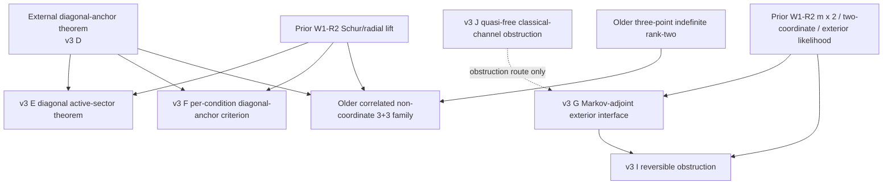

# PR43 dependency and version map

Status: **NEEDS_FIX** for version-entry clarity only. This is not a theorem verdict and does not duplicate C1's primary proof review. The frozen PR43 source exists at head `4e1369ef2a59ccfaba3ca8fce95d85e78857bf78` (`SOURCE.json:2-5`, `PR.json:51-54`).

## Scope of this report

I used only the frozen files under `research/I05-W1-20260909-R2/` from PR43. I did not run math computation, did not make a checksum manifest, did not review proofs for correctness, and did not access private historical material. The purpose here is to tell the integrator which claims live in which file version, what each claim depends on, and which pieces should be isolated for a second review after C1 finishes its first-pass proof verdicts.

## Current authoritative entry points

The cleanest current continuation entry points are:

- `continuation/README_v3.md:3-13`: marks the continuation as `PARTIAL / CONTINUATION NOT YET INDEPENDENTLY REVIEWED` and lists `RESULT_FINAL.md`, `frozen_statement_v3.md`, `proof_v3.md`, `sources_continuation.md`, and `CODEX_VERIFICATION_TASKS_v2.md`.
- `continuation/proof_v3.md:1-13`: calls itself the latest complete proof index; it points to the old W1-R2 proofs `01-03`, then `proof/04_diagonal_active_sector.md`, `proof/05_exterior_markov.md`, `proof/07_markov_adjoint_and_reversible_obstruction.md`, and `proof/06_quantum_measurement_obstruction.md`.
- `continuation/frozen_statement_v3.md:5-7`: says v3 is the latest frozen statement, superseding the v2 requirement that the Markov kernel be reversible.
- `continuation/RESULT_FINAL.md:6-8`: says the prior W1-R2 Schur, `m x 2`, two-coordinate support, and rank-two exterior likelihood results are included in this PR as author-level material still awaiting new independent review.

This makes v3 the safest entry point for PR43 integration. Older continuation files remain useful provenance, but they should not be treated as equally authoritative without an explicit author/C1 clarification.

## Superseded or conflicting version statements

| File/version | What it says | Current mapping |
|---|---|---|
| `continuation/frozen_statement_v2.md:87-124` and `proof/05_exterior_markov.md:32-42` | Markov intertwining is stated with a `p_C`-reversible kernel. | Superseded by `continuation/frozen_statement_v3.md:7,100-115` and `proof/07_markov_adjoint_and_reversible_obstruction.md:3-43`. In v3, the load-bearing condition is on the density adjoint `Q_theta^dagger`; reversibility is only a special case. |
| `continuation/CODEX_VERIFICATION_TASKS_v2.md:3,13-18` | Replaces the older task file's reversible-generator priority and says `proof/05` must be read through the correction in `proof/07`. | Treat `CODEX_VERIFICATION_TASKS.md` as historical for this point; use v2 for current review routing. |
| Root `frozen_statement_continuation.md:20-42`, root `RESULT_CONTINUATION.md:48-86`, and `proof/04_three_point_indefinite_rank2.md` / `proof/06_correlated_3plus3_family.md` | State three-point indefinite rank-two and correlated non-coordinate `3+3` positive claims. | These claims are not listed in the latest v3 proof index `continuation/proof_v3.md:7-13`, are not named as v3 positive results in `continuation/README_v3.md:24`, and are omitted from the five-result summary in `continuation/RESULT_FINAL.md:10-50`. They need explicit version-entry clarification before being treated as live PR43 theorem claims. |
| Root `README_CONTINUATION.md` and root continuation files | Present an older continuation reading order and older status language. | Superseded for current integration by `continuation/README_v3.md:3-13` and `continuation/proof_v3.md:1-13`. |
| `proof/04_diagonal_active_sector.md:3` | Says it proves v2 theorem E/E1/F. | The theorem content is retained in v3 at `continuation/frozen_statement_v3.md:19-76`; the file label is stale but not by itself a proof conflict. |

The smallest load-bearing documentation gap is the third row: the PR title/body and older root continuation package mention rank-two lifting, three-point, and `3+3` material, but the latest v3 frozen/proof entry points do not freeze those two positive claims. C1 can still review them as author files, but integration should not count them as accepted theorem claims unless the author or C1 confirms their version status.

## Claim/dependency matrix

| Unit | Live claim or role | Exact source lines | Assumptions and dependency notes | Mapping status |
|---|---|---|---|---|
| External diagonal-anchor input D | Entropy concavity for every full legal affine line through a strict diagonal Hermitian contraction. | `continuation/frozen_statement_v3.md:9-17`; v2 provenance at `continuation/frozen_statement_v2.md:9-19`; current proof index notes it at `continuation/proof_v3.md:13`. | Imported from another independent team. It is not reproved in PR43. Integration docs record the prior accepted diagonal/constant-center scope at `integration/docs/research_status.md:5-13` and the PR29/34 merge record at `integration/docs/integration_20260909.md:45,65`. | Dependency only; do not recertify here. |
| Prior W1-R2 Schur/radial lift | Exact complete-event Schur conditioning and entropy-chain radial lift. | `frozen_statement.md:47-86`; proof index `continuation/proof_v3.md:5-7`. | Used by every condition-line reduction. Already reviewed PR32/36/38 scope is recorded at `integration/docs/research_status.md:13` and `integration/docs/integration_20260909.md:36-39`; new rewritten PR43 text does not inherit extra scope automatically (`verification_round3/coordination_issue.md:7`). | Prior accepted scope only. |
| Prior `m x 2` and two observed-coordinate support | Full chord concavity when one block has size at most two, and arbitrary dimension when the cross block uses at most two observed coordinates on one side. | `frozen_statement.md:88-110`; `proof/03_lifting_and_exterior.md:53-61,87-89`; `continuation/RESULT_FINAL.md:8`. | This is the already accepted W1-R2 lane. It does not cover dense non-coordinate right singular planes because configuration entropy is tied to the observed coordinate basis (`proof/03_lifting_and_exterior.md:144`). | Prior accepted scope only; keep separate from new diagonal-sector claims. |
| Prior rank-two exterior likelihood | Likelihood ratio for rank-two cross block, with first/second exterior features and moment cancellations. | `frozen_statement.md:112-162`; `proof/03_lifting_and_exterior.md:89-144`; included in v3 proof index at `continuation/proof_v3.md:7`. | Interface for Markov-adjoint and feature/Hessian routes. It does not solve the fixed-basis general rank-two entropy problem (`frozen_statement.md:162`, `proof/03_lifting_and_exterior.md:144`). | Prior author/reviewed lane; new uses need C1 review. |
| Diagonal active-sector arbitrary cross-rank theorem E | If the cross block only enters a coordinate sector `J`, `C[J,J^c]=0`, and `C_J` is strict diagonal, then radial entropy is concave on the full legal interval; `|J|` and `rank(B)` are unrestricted. | `continuation/frozen_statement_v3.md:19-35`; proof file `proof/04_diagonal_active_sector.md:65-101`; result summary `continuation/RESULT_FINAL.md:12-20`. | Depends on Schur/radial lift plus external diagonal-anchor input D. It is a new author-level PR43 positive claim. | Live v3 claim; primary proof review is C1. |
| Explicit `3+5` example for theorem E | Demonstrates a case beyond old `m x 2` and two-coordinate support: both blocks larger than two, both internally non-diagonal, `rank(B)=2`, and right singular plane densely uses three coordinates. | `continuation/frozen_statement_v3.md:37-60`; `proof/04_diagonal_active_sector.md:103-164`; result summary `continuation/RESULT_FINAL.md:12`. | Illustration/certificate for theorem E's extra reach, not a separate general theorem. It still depends on theorem E and its imported diagonal-anchor input. | Live v3 example; separate from old W1 scope. |
| Per-condition-line diagonal-anchor criterion F | If every condition line `C-sM_S` passes through some strict diagonal kernel, the full radial family is concave. | `continuation/frozen_statement_v3.md:62-76`; `proof/04_diagonal_active_sector.md:166-189`; result summary `continuation/RESULT_FINAL.md:14-20`. | Depends on Schur/radial lift and external diagonal-anchor input D. It is a finite-check sufficient condition, not the general rank-two theorem. | Live v3 claim; primary proof review is C1. |
| Three-point indefinite rank-two directions | For strict real `3 x 3` kernels and real symmetric rank-two directions with opposite-sign nonzero eigenvalues, entropy is concave on each legal interval. | Root `frozen_statement_continuation.md:20-23`; root `RESULT_CONTINUATION.md:34-46`; proof file `proof/04_three_point_indefinite_rank2.md:3-140`. | Used by the older correlated `3+3` construction. The proof file itself says it relies on dimension three and the indefinite sign, and makes no claim for semidefinite rank-two directions (`proof/04_three_point_indefinite_rank2.md:136-140`). | Version-ambiguous: present in older/root continuation lane, not in latest v3 entry points. |
| Correlated non-coordinate `3+3` sufficient family | A structured `3+3` family with correlated non-diagonal blocks and dense rank-two cross block is claimed concave when its condition lines fall into rank<=1, indefinite rank2, or diagonal-anchor cases. | Root `frozen_statement_continuation.md:24-42`; root `RESULT_CONTINUATION.md:48-86`; `proof/06_correlated_3plus3_family.md:3-69,151-236`. | Depends on the three-point indefinite theorem, Schur/radial lift, and external diagonal-anchor input for empty/full condition lines. It is not the general non-coordinate rank-two theorem. | Version-ambiguous: present in older/root continuation lane; latest v3 names general correlated rank-two as open at `continuation/frozen_statement_v3.md:218` and `continuation/RESULT_FINAL.md:66`. |
| One-side diagonal / feature-route comparison | Records a one-side diagonal arbitrary-cross-rank theorem and sufficient-statistic/Hessian interface for rank-two exterior features. | `proof/05_diagonal_and_feature_routes.md:25-44,46-122`; older root `frozen_statement_continuation.md:44-64`. | The one-side diagonal statement is subsumed by v3 theorem E with `J` equal to the full right block. The Hessian/feature formulas are an interface; they retain the full Fisher term and leave general dimension sign open (`proof/05_diagonal_and_feature_routes.md:120-122`). | Background/support route; not a closed v3 general theorem. |
| General Markov-adjoint rank-two exterior intertwining G | If a stationary Markov kernel has density adjoint scaling `G_C` by `theta` and `d_C` by `theta^2`, then forward action sends `P_s` to `P_{theta s}`; generator version becomes a directed stationary-flow linear feasibility problem. | `continuation/frozen_statement_v3.md:78-149`; `proof/07_markov_adjoint_and_reversible_obstruction.md:5-76`; result summary `continuation/RESULT_FINAL.md:22-34`. | Depends on the prior rank-two exterior likelihood. It corrects the older reversible formulation in `proof/05_exterior_markov.md:32-42`; v3 says the density adjoint is load-bearing. | Live v3 interface/conditional claim; primary proof review is C1. |
| Diagonal exterior-degree closure H | For diagonal `C`, resolvent features are centered Bernoulli/Walsh degrees; independent refresh scales first degree by `theta` and second degree by `theta^2`. | `continuation/frozen_statement_v3.md:151-169`; `proof/05_exterior_markov.md:63-110`; result summary `continuation/RESULT_FINAL.md:56`. | Explains why diagonal-product noise realizes the degree split. This supports intuition behind diagonal-anchor mechanisms but is not a replacement for the imported diagonal-anchor theorem. | Live v3 support claim; exact checks may be separate. |
| Reversible exterior semigroup obstruction I | In a strict correlated two-point example, `d_C` and `(G_C)12` have inner product `-125/78`, so a reversible Markov operator cannot scale them with distinct eigenvalues `theta^2` and `theta`. | `continuation/frozen_statement_v3.md:171-195`; `proof/07_markov_adjoint_and_reversible_obstruction.md:91-171`; result summary `continuation/RESULT_FINAL.md:36-48`. | Excludes a universal reversible exterior-noise mechanism only. It explicitly does not refute DPP concavity or nonreversible/hidden-state routes (`continuation/frozen_statement_v3.md:195`, `proof/07_markov_adjoint_and_reversible_obstruction.md:168-175`). | Live v3 obstruction; high-risk orientation/orthogonality unit. |
| Quasi-free/classical occupation-channel obstruction J | Two quasi-free inputs with identical occupation distribution become distinguishable after the same correlated fixed-point covariance decay, so no universal classical occupation kernel represents that quantum channel. | `continuation/frozen_statement_v3.md:197-214`; `proof/06_quantum_measurement_obstruction.md:5-88`; result summary `continuation/RESULT_FINAL.md:50-58`. | Obstruction only. It does not deny quantum data processing and is not a DPP entropy-concavity counterexample (`proof/06_quantum_measurement_obstruction.md:82-88,118`). | Live v3 obstruction; lower integration dependency than E/F/G/I. |

## Dependency picture

## Recommended smallest high-risk second-review units after C1 first pass

1. **Version-entry clarification unit.** Ask whether `proof/04_three_point_indefinite_rank2.md` and `proof/06_correlated_3plus3_family.md` are live PR43 theorem claims, historical continuation material, or background lemmas no longer frozen in v3. This is the smallest blocking unit because it determines whether those proofs should be counted at integration at all.

2. **Diagonal-sector dependency transfer unit.** If C1 accepts the local proof shape, independently check only the transfer chain `external diagonal-anchor input D -> condition lines -> radial t-parameter`. Bound it to `continuation/frozen_statement_v3.md:19-76` and `proof/04_diagonal_active_sector.md:65-189`, with the prior Schur/radial result used only as an already accepted dependency.

3. **Markov-adjoint orientation unit.** Review only the direction of the density adjoint and the v2-to-v3 correction: `continuation/frozen_statement_v3.md:78-149`, `proof/07_markov_adjoint_and_reversible_obstruction.md:5-76`, and the superseded reversible special case `proof/05_exterior_markov.md:32-42`. This is high-risk because a forward/backward operator flip changes the statement.

4. **Reversible obstruction exactness unit.** Review only the `-125/78` inner product and the self-adjoint different-eigenvalue orthogonality conclusion at `proof/07_markov_adjoint_and_reversible_obstruction.md:91-171`. Keep the conclusion scoped to “no universal reversible exterior semigroup,” as required by `continuation/CODEX_VERIFICATION_TASKS_v2.md:50-65`.

5. **Older three-point/`3+3` unit only if declared live.** If C1/author says those files are live theorem claims, split them into two independent checks: first `proof/04_three_point_indefinite_rank2.md:3-140`, then `proof/06_correlated_3plus3_family.md:3-69,151-236`. The second depends on the first plus the external diagonal-anchor input, so reviewing them together would blur failure attribution.

6. **Quasi-free obstruction unit.** Review `proof/06_quantum_measurement_obstruction.md:5-88` only after the positive theorem units, because it is an obstruction to a proof route rather than a positive entropy theorem. The review should check that it is not overstated beyond `continuation/frozen_statement_v3.md:197-214`.

## Head-bound conclusion

**NEEDS_FIX**: the dependency map is usable, but PR43 head `4e1369ef2a59ccfaba3ca8fce95d85e78857bf78` has a load-bearing version-entry ambiguity. The latest v3 files cleanly supersede the reversible Markov formulation, but they do not clearly say whether the older three-point indefinite rank-two and correlated non-coordinate `3+3` positive claims remain live theorem claims. Until that is clarified, integration should treat E/F/G/I/J as the live v3 continuation package and keep the three-point/`3+3` files in a separate pending-version lane.
